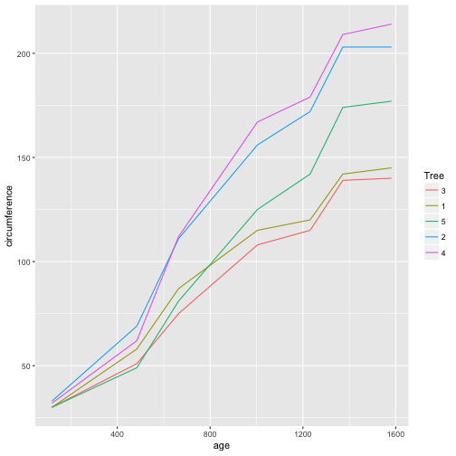

### Question 1

The functions that I am aware of in base R that support the split-apply-combine strategies are the apply family of functions. However, to be honest, I never use these functions. When I first learned R, they were briefly mentioned, but there was not much emphasis put on them. I never took the time to go back and teach them to myself. Instead, I discovered the function `subset`. With `subset`, for loops, and square brackets, I have always able to accomplish the data manipulation that I needed to. 

I would say that the base R functions are sufficient in the sense that they allow one to get the data manipulation job done. However, the code often ends up being long and clunky (at least mine does). In this sense, the base R functions are lacking. Having functions that are specifically designed to streamline the data manipulation process would be a huge advantage.

### Question 2


library(dplyr)
library(ggplot2)
library(knitr)


The `Orange` dataset in base R contains information on the growth of 5 orange trees. The first few rows of the data are shown below. The circumferences of the trees are recorded at the same 7 ages for each tree.


head(Orange)



##   Tree  age circumference
## 1    1  118            30
## 2    1  484            58
## 3    1  664            87
## 4    1 1004           115
## 5    1 1231           120
## 6    1 1372           142


A plot of the change in circumference over time for each tree is included below.


ggplot(Orange, aes(x = age, y = circumference)) +
  geom_line(aes(color = Tree))


It may be of interest to determine the mean and standard deviation of the circumferences at each age. To make use of the split-apply-combine strategy, the data would need to be split into groups by age. Then the mean and standard deviation of the circumferences would need to be calculated for each group. Finally, the means and standard deviations would need to get combined into a new dataset. 

To accomplish this task, I will make use of functions `group_by` and `summarise` from the `dplyr` package. I named this new dataset `summary`, and it is shown in the table below.


summary <- Orange %>% 
  group_by(age) %>%
  summarise(mean = mean(circumference), 
              sd = sd(circumference))
kable(summary)


|     mean|       sd|
|--------:|--------:|
| 115.8571| 57.48818|

