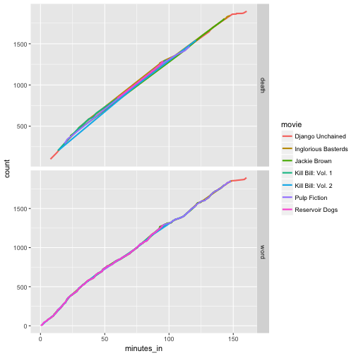

  
    
    
 
The data analysis strategy of **Split-Apply-Combine** creates a concise description of the basic operations that occur at the start of most analyses. The split-apply-combine procedure is to **split** your data into pieces, **apply** a function to each piece, and **combine** those pieces back together with the results. 
  
    
    
#### 1. Which (base R) functions do you know that support the split-apply-combine strategy? In your opinion, are these sufficient - state why or why not?

There are several base `R` functions that support the split-apply-combine strategy. A few of the more commonly used functions include `subset()`, `split()`, `with()`, `by()`, `apply()`, `sapply()`, `lapply()`, `tapply()`, `aggregate()`, `rbind()`, and `cbind()`. These functions can be combined in different combinations to tackle any task `plyr` can complete, but the functions are more rigid in their abilities and the syntax is inconsistent. It is also possible to write custom functions using `for()` loops to do your analysis; however, this requires you to write a lot of code simply for bookkeeping purposes. 

In my opinion, the key advantage of using `plyr` (and now `dplyr` in combination with the other `tidyverse` packages) is that after you overcome the learning curve, programming becomes more intuitive and concise. In addition, I think that it becomes easier to reproduce your code. 

  
    
    

#### 2. Using a dataset of your choice, describe how you can use the split-apply-combine strategy for a part of the data analysis.
  

To find a dataset I went to FiveThirtyEight's github repository that contains a collection of some of the datasets used in FiveThirtyEight's articles. Hoping to avoid any dataset involving politics or current events for the evening, I chose to use the `tarantino` dataset, a complete catalog of every time someone cursed or bled out in a Quentin Tarantino movie. Using the split-apply-combine strategy with the `dplyr` package, I worked to recreate part of the analysis done by FiveThirtyEight. 

After reading in the data, I first summarized the data by getting the total counts for curses and deaths in each movie and then created a new variable that is a curse to death ratio for each movie. 


films <- read_csv( curl("https://raw.githubusercontent.com/fivethirtyeight/data/master/tarantino/tarantino.csv"))

films %>% count(movie, type) %>% group_by(movie) %>% summarize(curses=n[type=="word"], deaths=n[type=="death"], curse_ratio=curses/deaths) %>% arrange(desc(curse_ratio))



## Error in count(., movie, type): object 'movie' not found


I then combined the split-apply-combine strategy with the `dplyr` and `ggplot2` packages, to visualize how the number of curse words and deaths accumulate throughout the time span of each movie.


films %>% group_by(movie, type) %>% mutate(count =rank(minutes_in)) %>% ggplot(aes(x=minutes_in, y=count, color=movie)) + geom_line(size=1)+facet_grid(type~., scale="free")


